# ISCY GUI Screenshots

Stand: ISCY V23.7.16 / Rust 0.3.12

Diese Screenshots dokumentieren die aktuelle serverseitige ISCY-Weboberflaeche fuer die wichtigsten Tabs und Funktionsbereiche.

## Dashboard

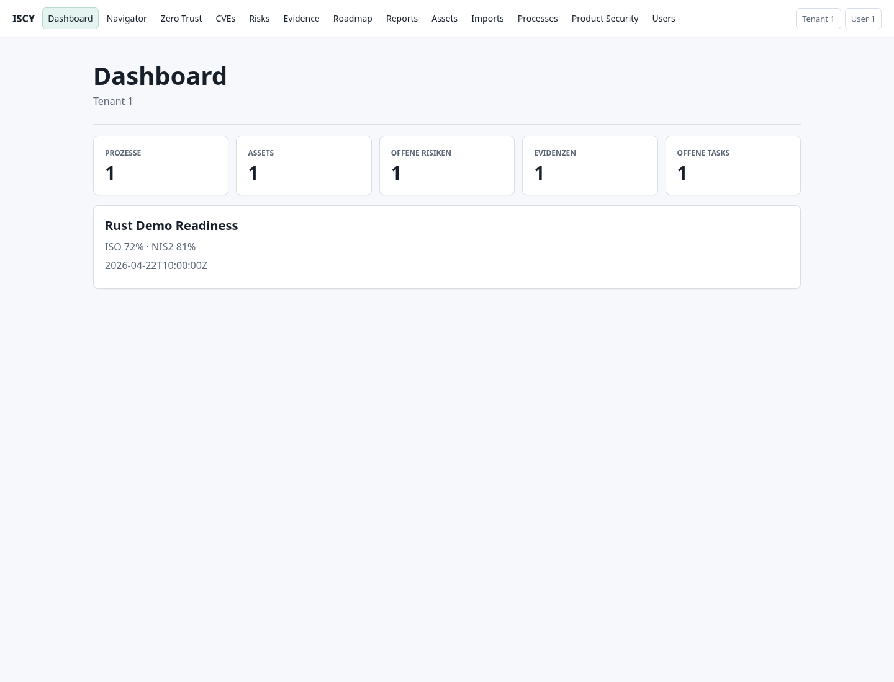

## Guidance Navigator

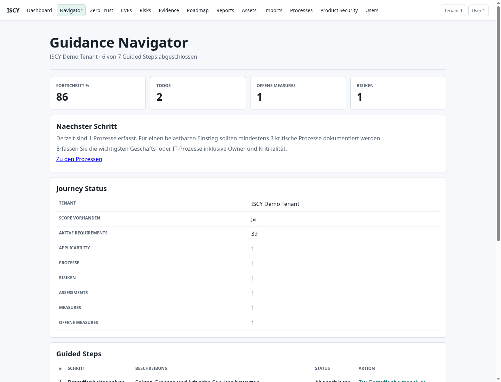

## Zero Trust Desktop

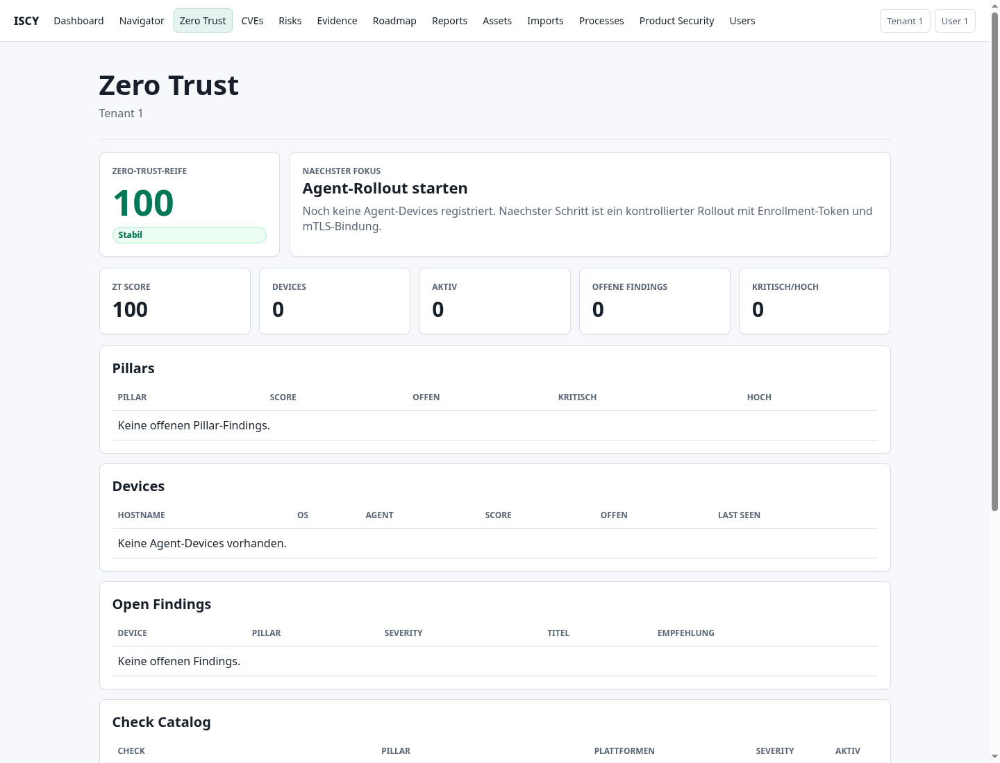

## Zero Trust Mobile

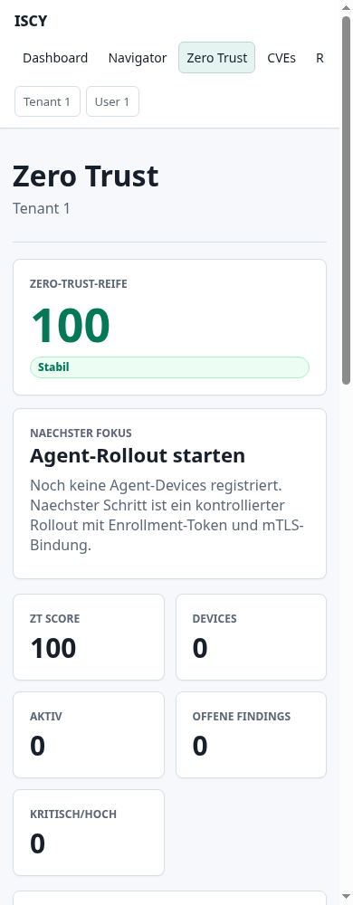

## CVEs

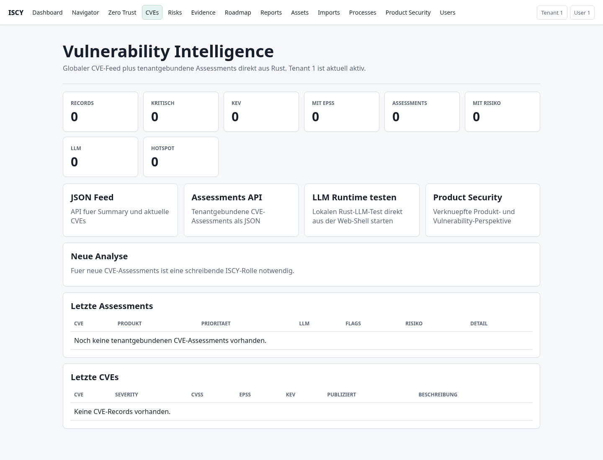

## Risks

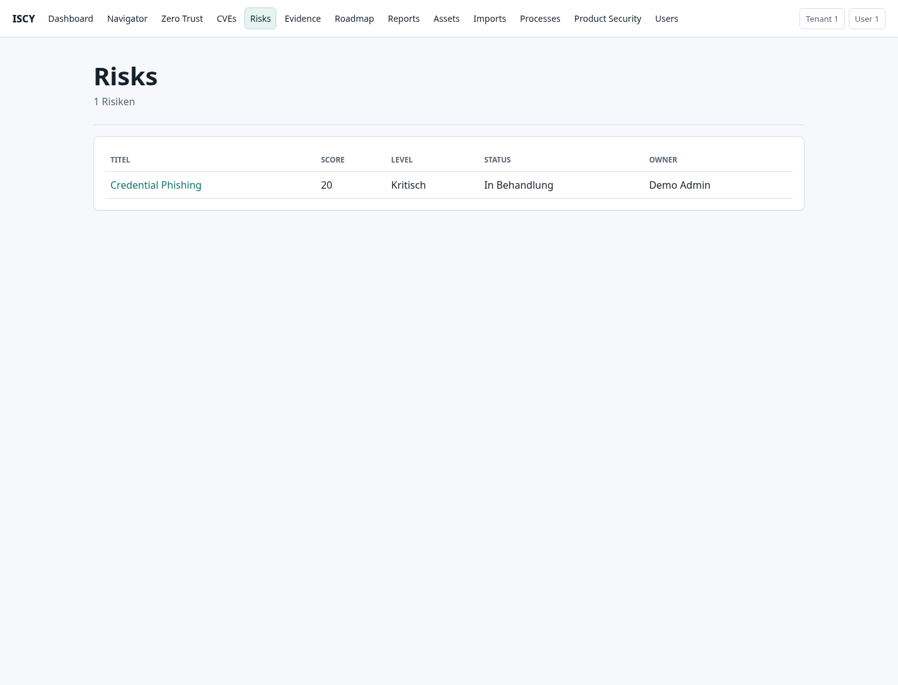

## Evidence

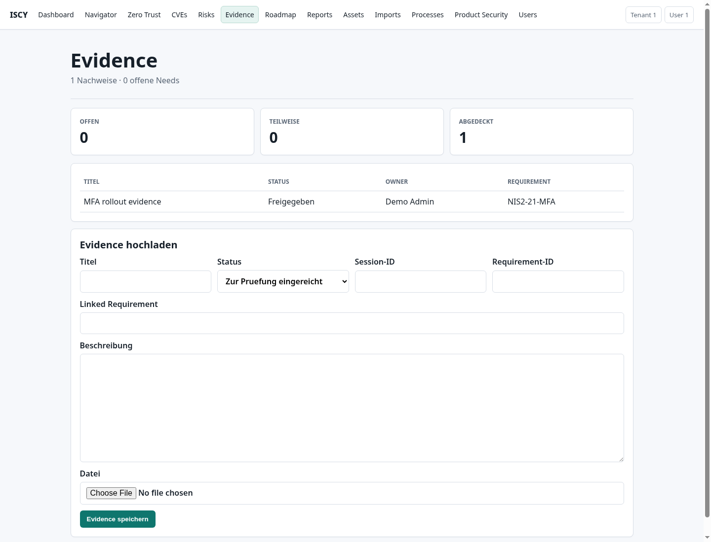

## Roadmap

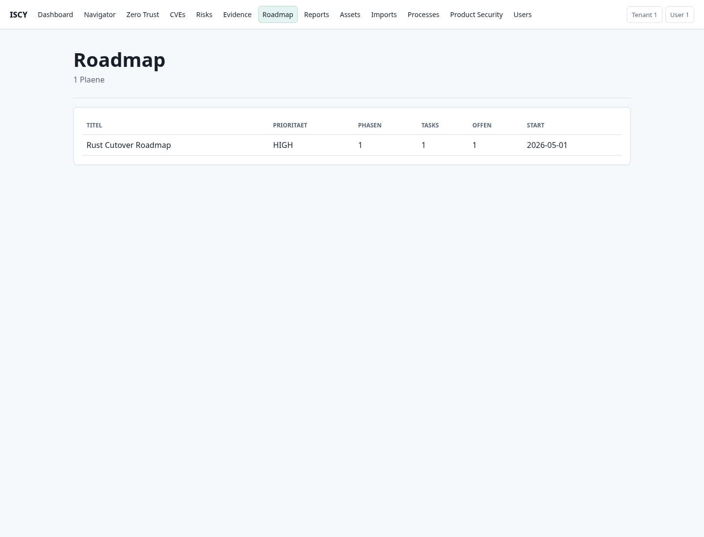

## Reports

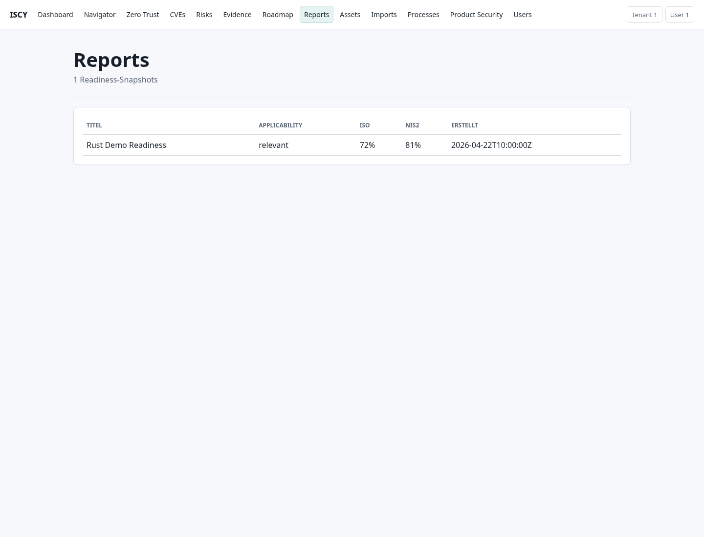

## Assets

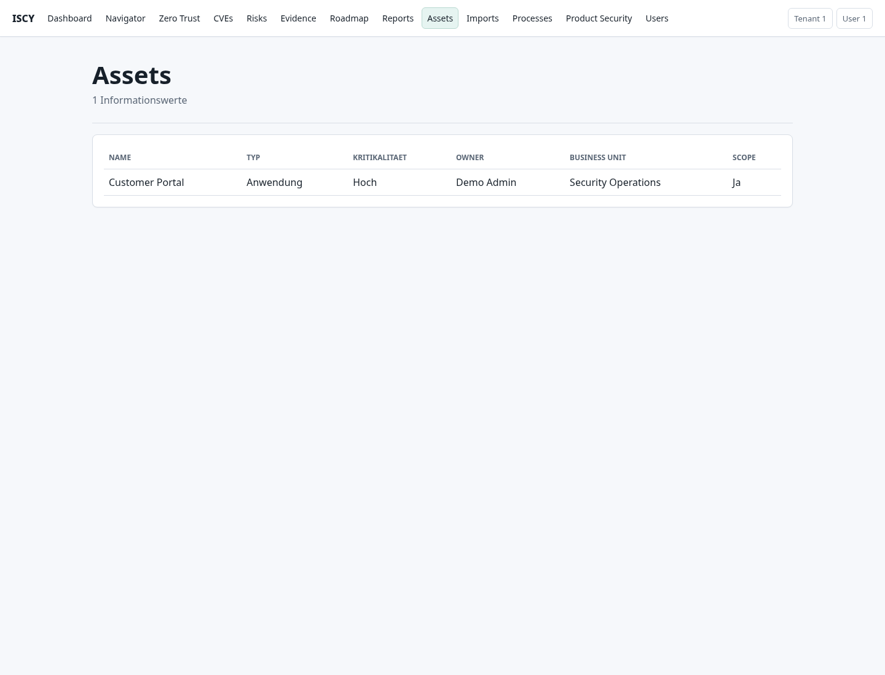

## Imports

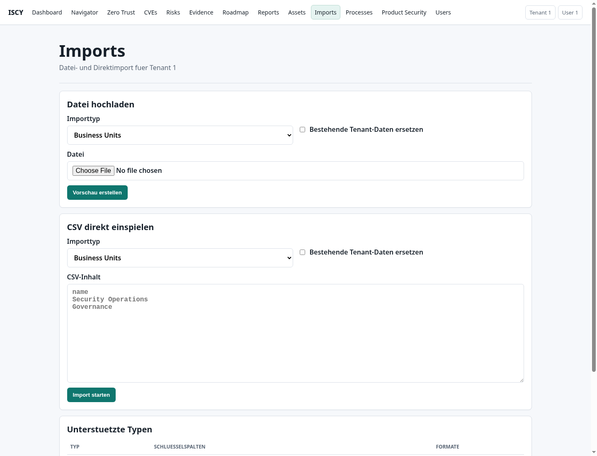

## Processes

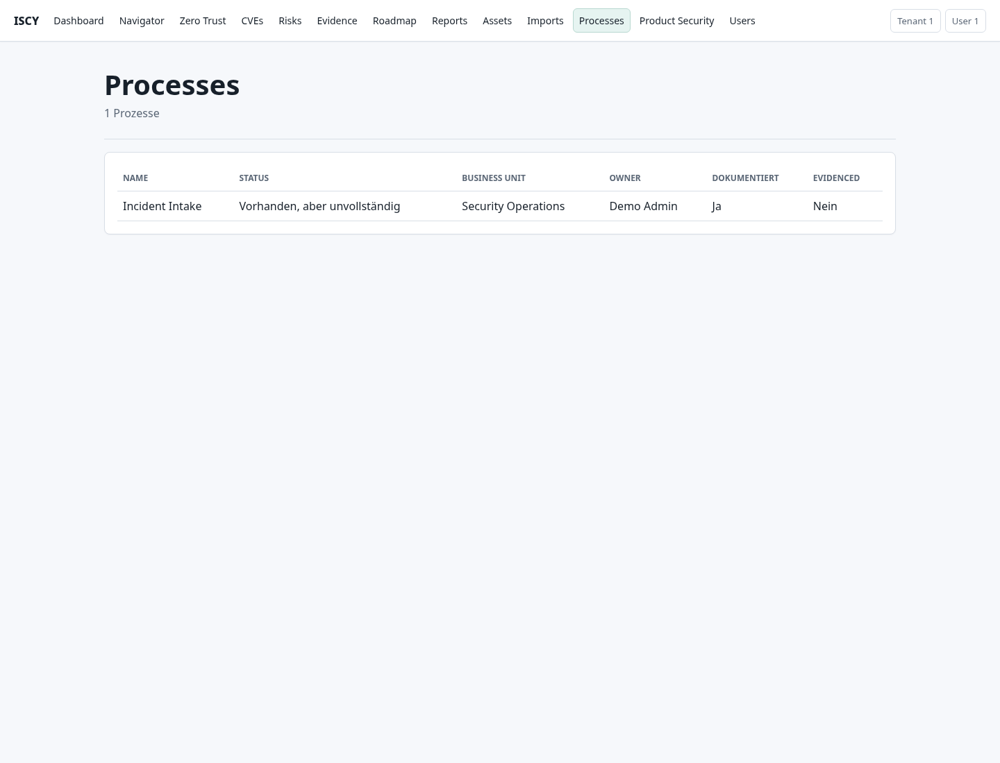

## Product Security

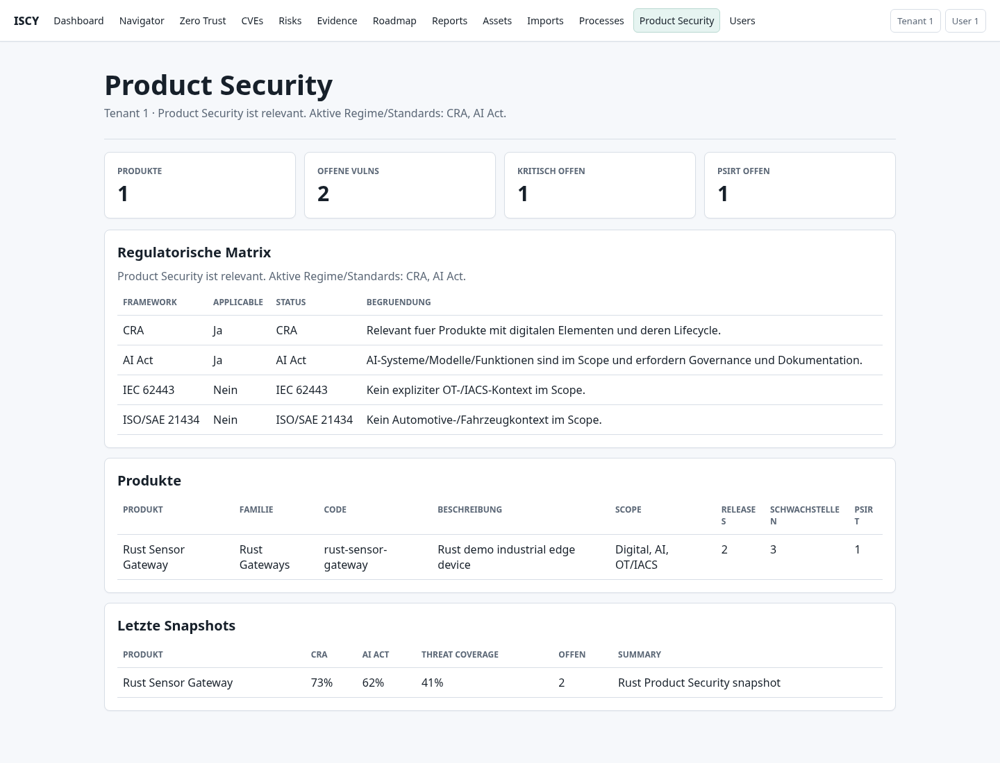

## Users

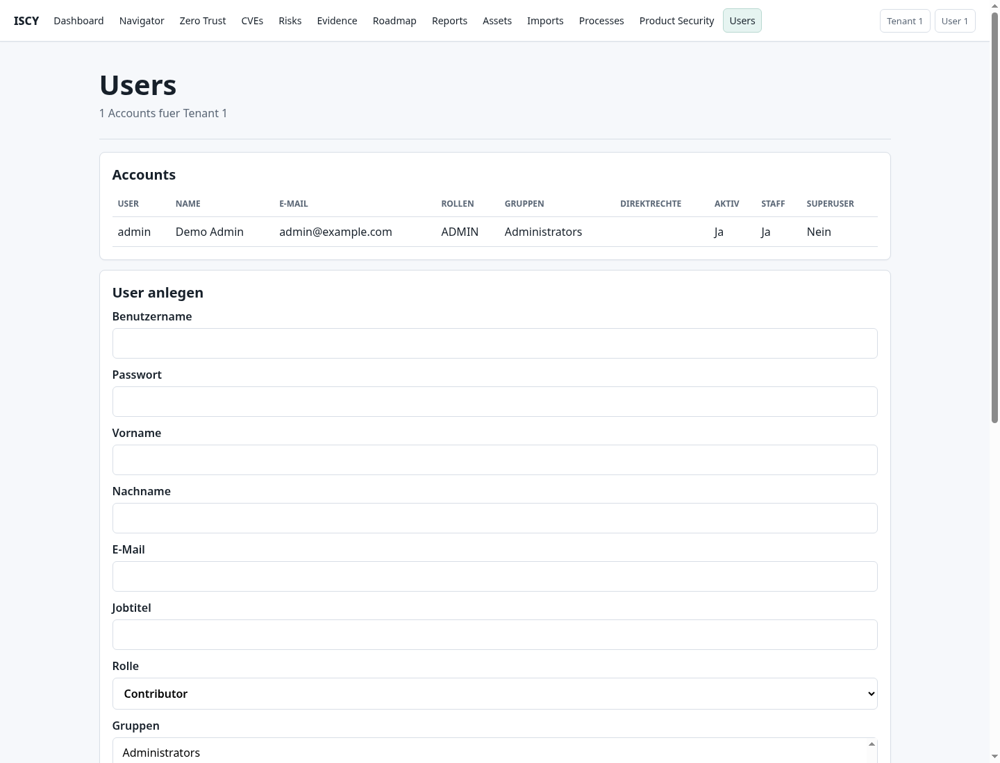
